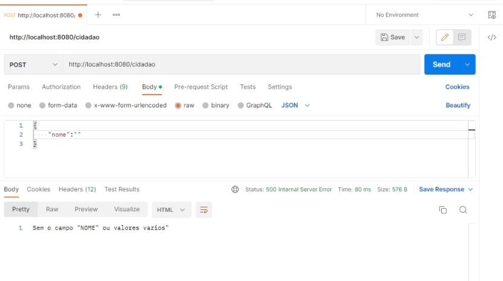
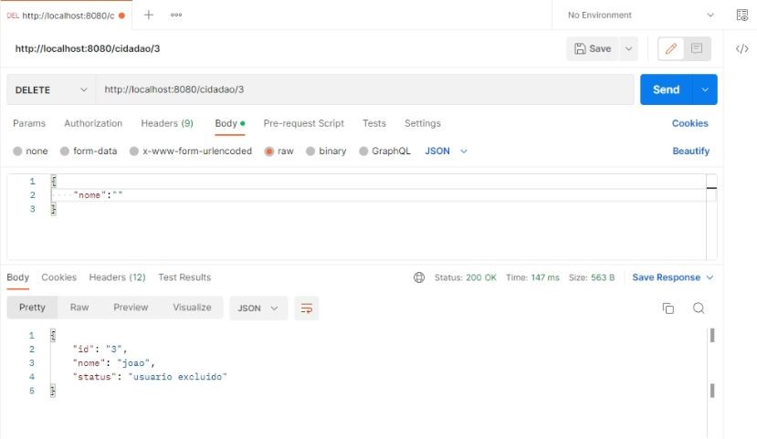
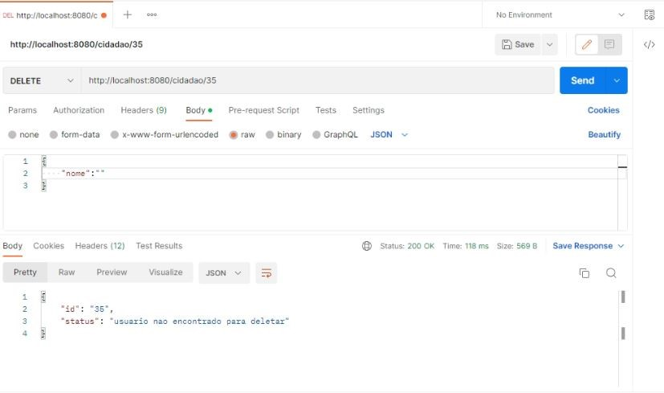
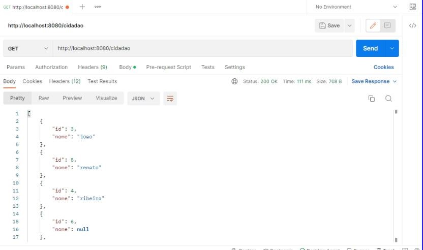
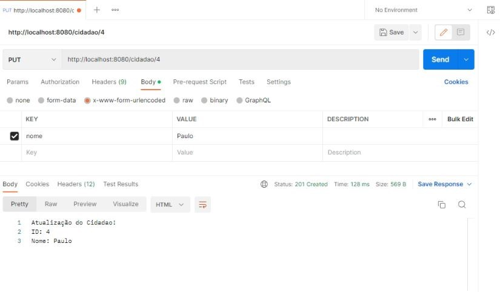
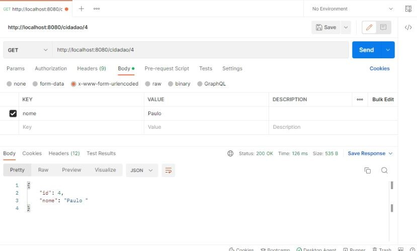
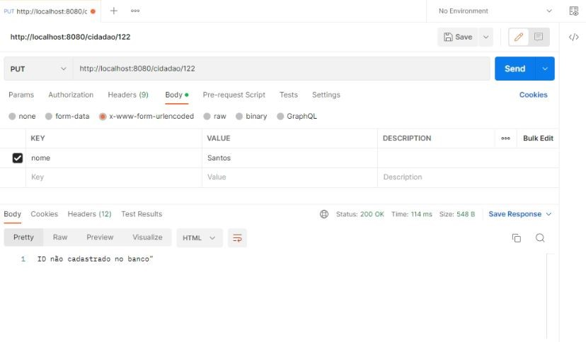

# API Politiza 

🚀 Exemplo de um CRUD que pode ser utilzado no projeto Politiza (https://github.com/lucasrp98/politiza)

### Pré-requisitos

Antes de começar, você vai precisar ter instalado em sua máquina as seguintes ferramentas:

Além disto é bom ter um editor para trabalhar com o código como [VSCode](https://code.visualstudio.com/)

### 🎲 Rodando o Back End (servidor)

### Clone este repositório
$ git clone <https://github.com/lucasrp98/trabalho_webII>

### Execute a aplicação em modo de desenvolvimento
$ php -S localhost:8080 -t public  

### O servidor inciará na porta:8080 
Acesse no seu navegador o seguinte link: <http://localhost:8080>

### 🛠 Tecnologias

As seguintes ferramentas foram usadas na construção do projeto:

- [PHP](https://www.php.net/docs.php)
- [Postman] (https://www.postman.com/)

### Screenshots

Request GET: (/cidadao): Retorna uma lista de cidadãos cadastrados via JSON no banco.

Response: 
200 - JSON com o array dos cidadãos que foram adicionados no JSON. 
<h1 align="center">
  
</h1>

Request GET: (/cidadao/{id}): Retorna o usuário especificado no ID pela URL.

Response: 
200 - JSON com o cidadão especificado no ID. 
404 ou 500 - Retorna que o usuário não está cadastrado no banco. 
Exemplos: Response 200. 

<h1 align="center">
  
</h1>

Response 404 ou 500. 

<h1 align="center">
  
</h1>

Request POST: /cidadao/json: Inseri um cidadão via JSON no banco de dados, o id se auto incrementa por isso não é adicionado neste post.

Response:
200 - JSON com os dados da postagem
	400  – campos obrigatórios não informados

Corpo da requisição:
{
“nome”: “Nome do usuário que será adicionado no banco de dados”,
}

Response 200

<h1 align="center">
  
</h1>

Response 400 ou 500

<h1 align="center">
  
</h1>

Request Delete: (/cidadao/{id}): Realiza a exclusão do usuário através do ID especificado na URL. 

Response:
200 - Excluir o usuário solicitado pelo ID. 
400  – Relata que não encontrou o ID do usuário no banco. 

Response 200

<h1 align="center">
  
</h1>

Response 400

<h1 align="center">
  
</h1>

Request PUT: /cidadao/{id}: Realiza a exclusão do usuário através do ID especificado na URL. 

Response:
200 - Retorna os dados atualizados do cidadão.
	400  – ID não encontrado no banco.

Response 200

Get - Antes da atualização

<h1 align="center">
  
</h1>

Atualização do usuário 

<h1 align="center">
  
</h1>

Get - Após a atualização

<h1 align="center">
  
</h1>

Response 400 ou 500

<h1 align="center">
  
</h1>

### 🛠 Autor 
Feito com ❤️ por Lucas Ribeiro👋🏽 Entre em contato!

   

